<div align="center">
  <a href="https://git.io/typing-svg">
    
  </a>
</div>

<br>

<div align="center">
    
</div>


```shell
> SYSTEM_OVERRIDE: INITIATED
> ACCESSING DEEP_CORE_DATA...
> LOCATION: SECTOR EARTH
> STATUS: BUILDING SCALABLE NEURAL NETWORKS (AND WEB APPS)
```

### ▚▚▚ DIRECTIVE LOGS ▚▚▚
I am a Full-Stack Engineer operating at the intersection of high-performance architecture and experimental physics. When I am not forging hyper-optimized systems in **React, Next.js, and Node.js**, I am running simulations in my garage to completely disable the effects of gravity on standard desk chairs.

---

### ▚▚▚ CORE NEURAL IMPLANTS [TECH STACK] ▚▚▚
> *Systems used for orbital mechanics and full-stack web propulsion.*

<div align="center">
  <a href="https://skillicons.dev">
    
  </a>
</div>

<br>

* 🟩 **Holo-Interface [Frontend & Mobile]:** `JavaScript`, `React`, `React Native`, `Next.js`
* 🟩 **Core Processors [Backend]:** `Node.js`, `Express.js`
* 🟩 **Data Grid & Sub-Ether [Infrastructure]:** `Docker`, `Redis`, `AWS`

---

### ▚▚▚ SYSTEM DIAGNOSTICS [GITHUB STATS] ▚▚▚

<div align="center">


</div>


<div align="center">
  <picture>
    
  </picture>

  <br><br>

  <!-- Cybernetic Tetris Bomb Game Animation -->
  <h3>▚▚▚ SYSTEM OVERLOAD ▚▚▚</h3>
  <picture>
    
  </picture>
</div>

---

### ▚▚▚ CURRENT OPERATION ALGORITHMS ▚▚▚

```javascript
async function executeCybernetics() {
  const stack = await System.load(['Next.js', 'Redis', 'AWS']);
  
  if (Gravity.status === 'ENABLED') {
     console.warn("WARNING: Antigravity module still experimental.");
     console.log("Coffee mug destruction imminent.");
     return stack.buildScalableApp();
  } else {
     return initiateHoverboardProtocol();
  }
}

executeCybernetics();
```

---

### ▚▚▚ SECURE TRANSMISSION CHANNELS ▚▚▚
> *Bypass the firewall and establish direct peer-to-peer contact.*

<div align="center">

[](https://www.linkedin.com/in/vasudev-bansal-9191b2295/)
[](https://leetcode.com/u/sRQnn9uccM/)
[](mailto:vasudevbansal375@gmail.com)

</div>

<br>
